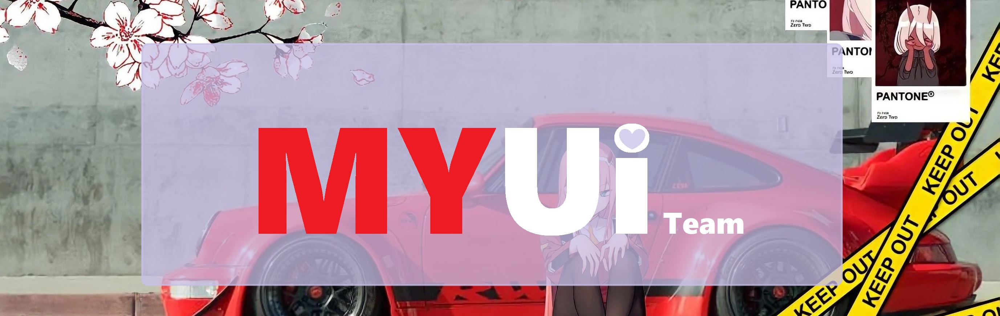
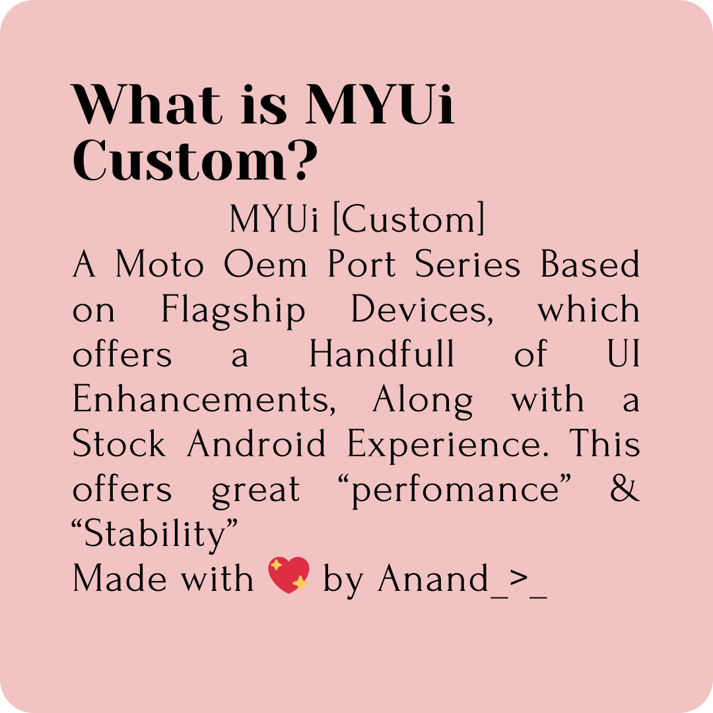
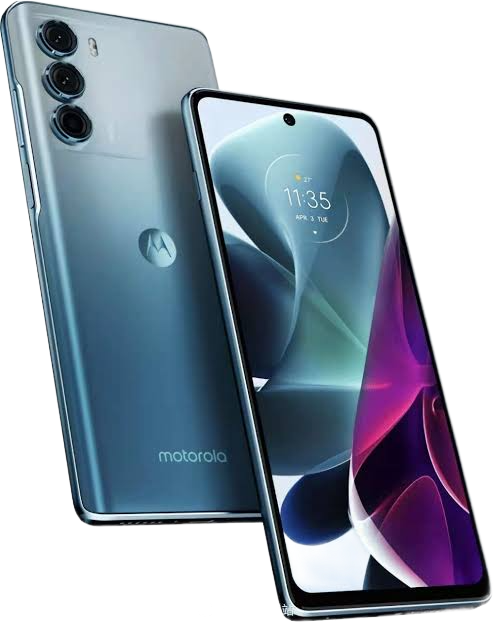
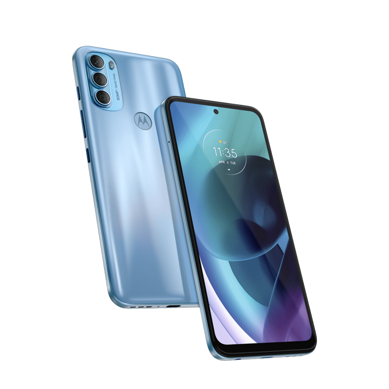
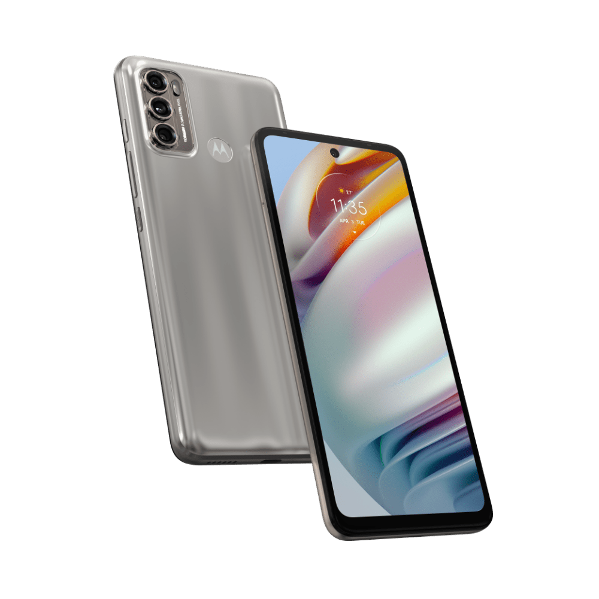
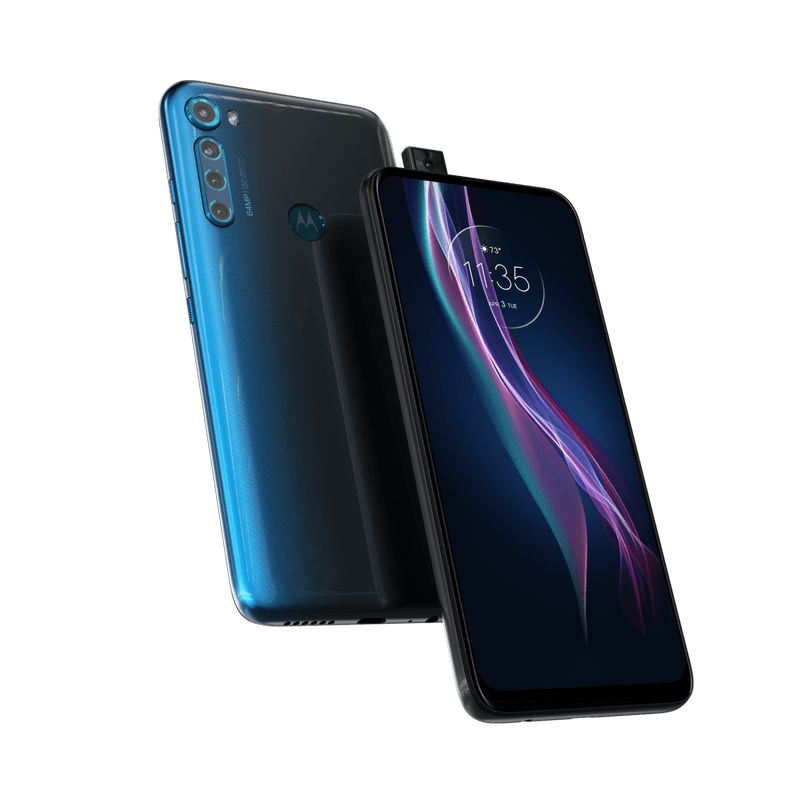
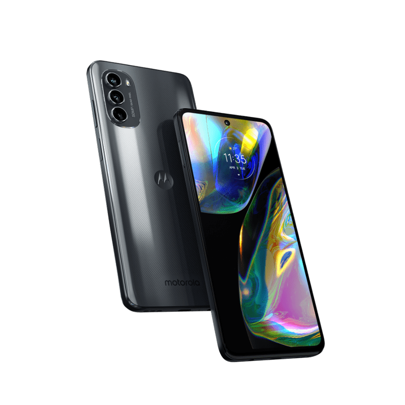
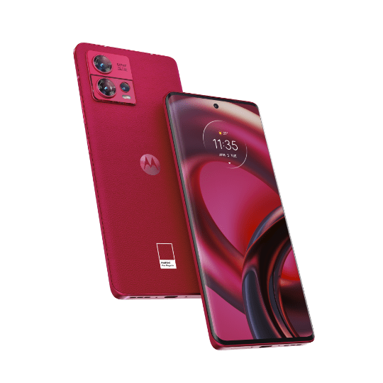

# M Y U I   C U S T O M



<center> 
<h2><span>[ <a href="/">Home</a> | </span>
	<span><a href="/wallpapers/">Wallapapers</a> | </span>
	<span><a href="https://t.me/hanoipprojects">Support</a> ]</span>
</h2></center>


<center>

</center>


## Supported Device List 

| Devon | Xpeng | Corfur |
|---|---|---|
|  |  |  |
| Dubai | Hanoip | hawao |
|  |  |  |
| liber | Rhode | Rhodei |
|  |  |  |
| Rhodep | Tundra | Xpeng |
|  |  |  |


---

<center>
<h1>Get MYUi for Your Device</h1>
<p>[ Scroll Down for Download link ]</p>
</center>
```

Disclaimer: [ MYUI Custom ] 

By installing and using [ MYUI Custom ], you acknowledge and agree to the following:

1. Warranty Disclaimer:
   [ MYUI Custom ] is provided "as-is" without any warranties of any kind, either expressed or implied, including but not limited to fitness for a particular purpose, accuracy, or reliability.

2. Data Loss and Device Damage:
   The installation and use of OEM Ports carry inherent risks, including the potential loss of data and damage to your device. You understand and accept that neither the developers nor the contributors of [ MYUI Custom ] shall be held responsible for any loss of data or damage to your device.

3. No Official Support:
   [ MYUI Custom ] is not an official release by Motorola LLC . Any support provided is on a best-effort basis and may not be as comprehensive as official support.

4. Security and Stability:
   OEM Ports may have security vulnerabilities or stability issues that could compromise the performance and functionality of your device. Selinux of is Permissive ( Google for that ). You acknowledge that you are installing [ MYUI Custom ] at your own risk.

5. Backup and Recovery:
   It is strongly recommended that you backup your data and create a recovery plan before installing [ MYUI Custom ]. In the event of problems, you may need to revert to the original software.

6. User Responsibility:
   You assume full responsibility for any consequences resulting from the installation and use of [ MYUI Custom ]. This includes understanding and accepting the risks associated with custom ROMs.

7. Legal Implications:
   Some actions, including unlocking bootloaders and installing OEM Ports , may void warranties and violate terms of service or user agreements with device manufacturers. You are solely responsible for any legal consequences arising from such actions.

By proceeding with the installation of [ MYUI Custom ], you acknowledge that you have read, understood, and agreed to this disclaimer.
```

<center>
<a href="https://devuploads.com/users/Anandbizuka">

</a>
</center>
